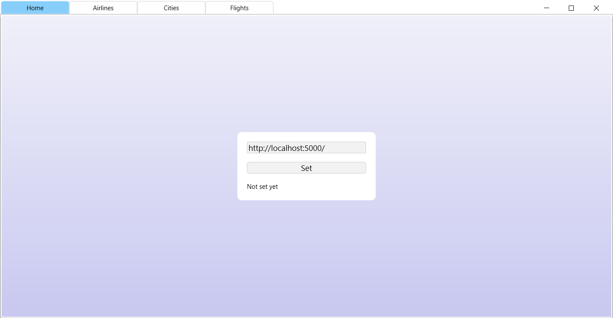
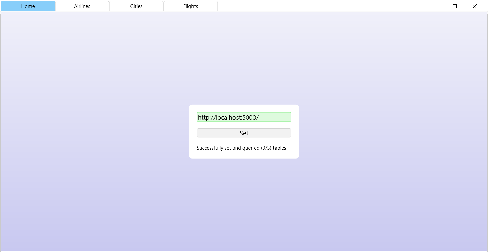
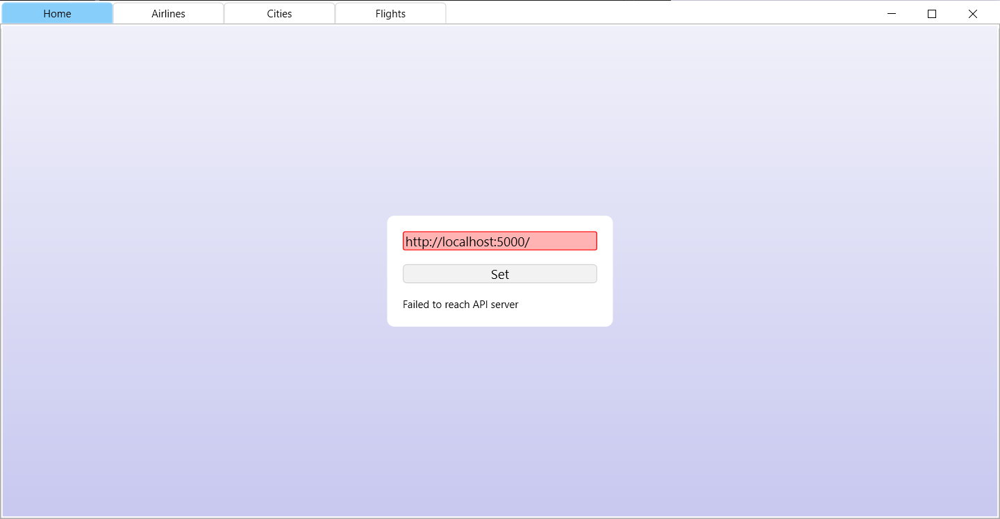
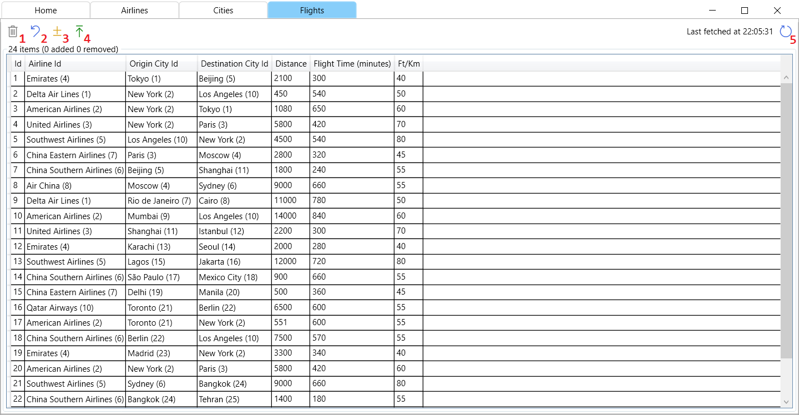
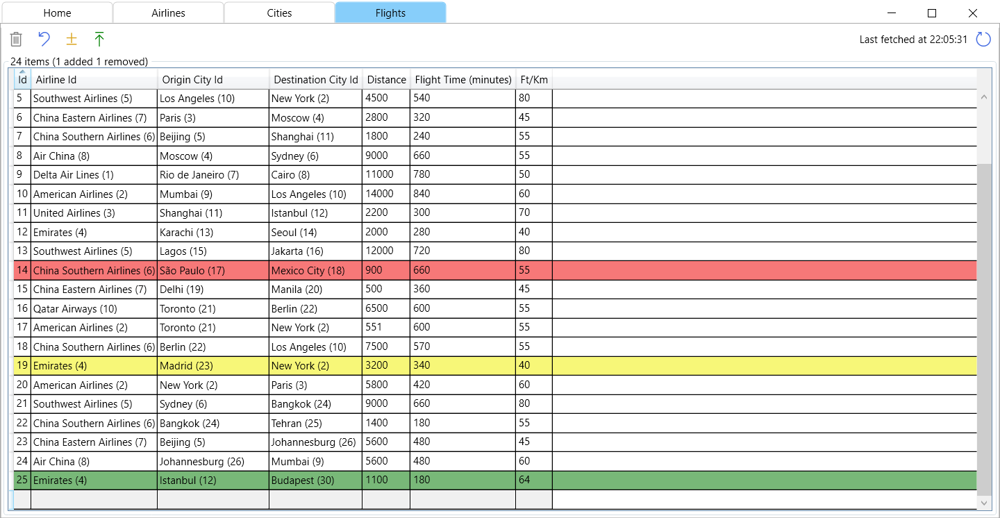
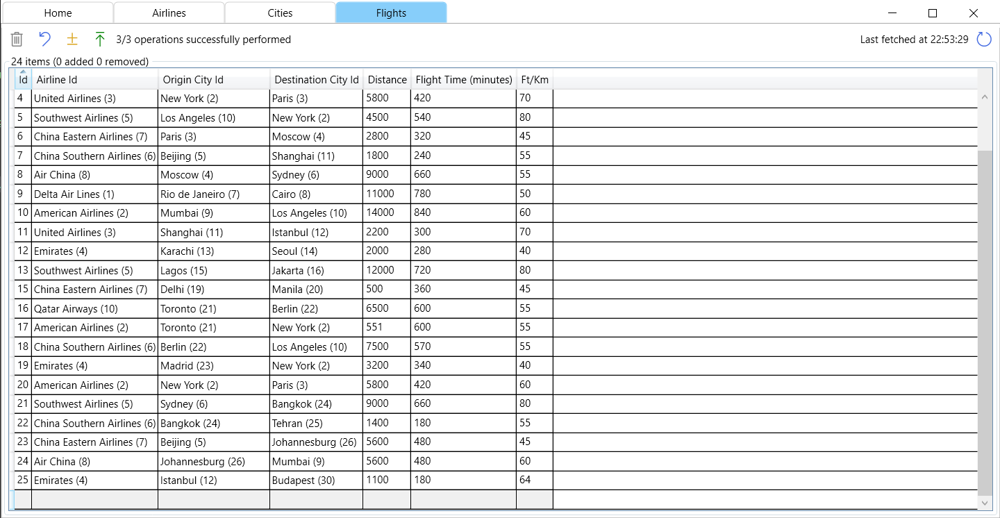
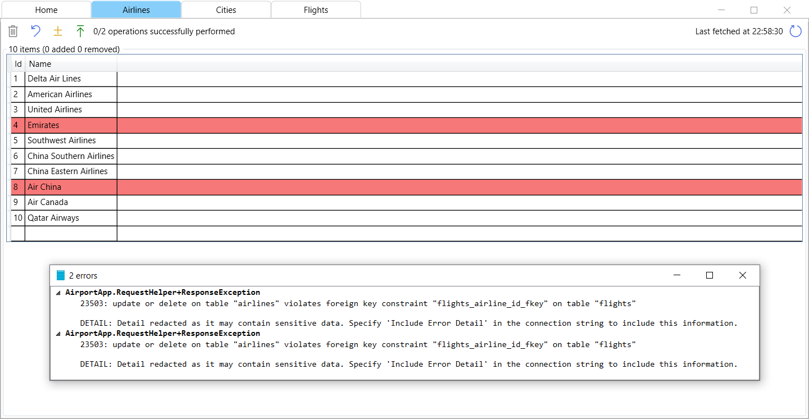
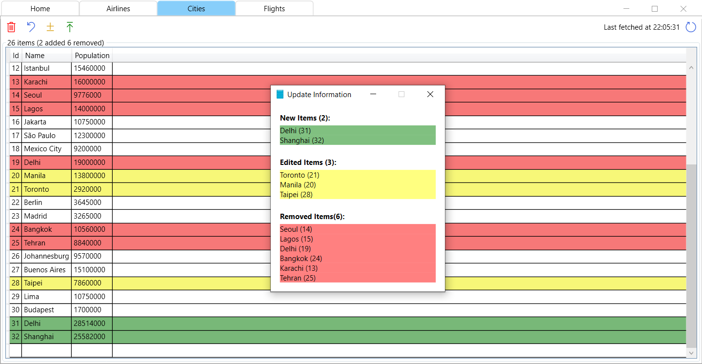

#  Desktop Application Manual

## Table of Contents
- [Initial State](#initial-state)
- [Successful Connection](#successful-connection)
- [Connection Failure](#connection-failure)
- [Tabs](#tabs)
- [Table Tab Buttons](#table-tab-buttons)
- [Table Changes](#table-changes)
- [Successful Operations](#successful-operations)
- [Unsuccessful Operations](#unsuccessful-operations)
- [Table Changes Summary](#table-changes-summary)

## Usage

### Initial State

To check connectivity with the API and query all tables specify the address of the api then click the `Set` button.

***

### Successful Connection

A successful connection is indicated by the status message and the green color of the textbox.

***

### Connection Failure

A successful connection is indicated by the error message and the red color of the textbox.

***

### Tabs

The tabs at the top of the window can be used to navigate between the `Home` and the three table tabs.

***

### Table Tab Buttons

1. Delete selected Items.
2. Reset changes back to the state of the last fetch.
3. Show pending changes
4. Commit changes.
5. Refetch table.

When resetting changes the local table always takes up the values that the database had at the time of the last fetch and loses all pending changes. The last time a fetch was performed is shown on the left of the button.

***

### Table Changes

The background of the rows indicates different operations.
| Color | Operation |
| --- | --- |
| Red | Item is going to be deleted from the database |
| Yellow | Item is going to be modified in the database |
| Green | Item is going to be added to the database |

***

### Successful Operations

As we can see, after the operations are performed the results of are displayed right next to the commit/upload button. After this the table is fetched again from the database so we can confirm that all three operations were indeed successful.

***

### Unsuccessful Operations

If one or more operations fail, we get an error popup that details what went wrong. Unsuccessful operations are preserved even after the table is fetched again, but can be discarded by using the reset button.

***

### Table Changes Summary

The show pending changes button can give a helpful summary of all the changes that would be performed when dealing with a large amount of operations.
